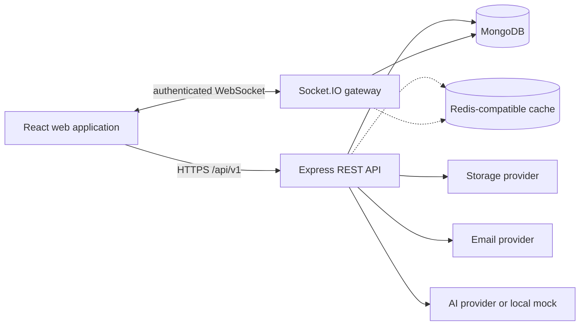
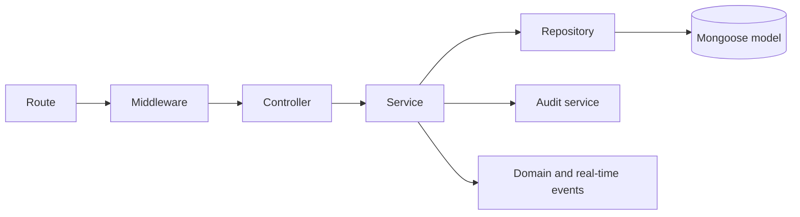
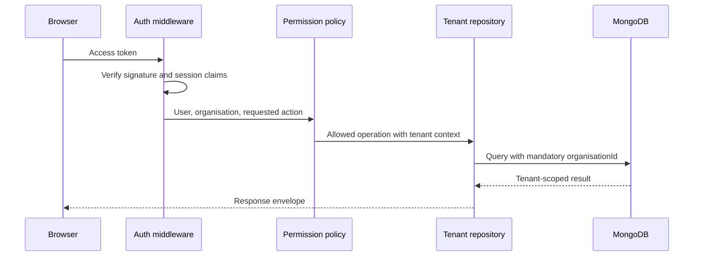
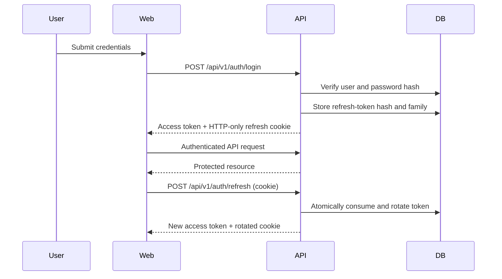
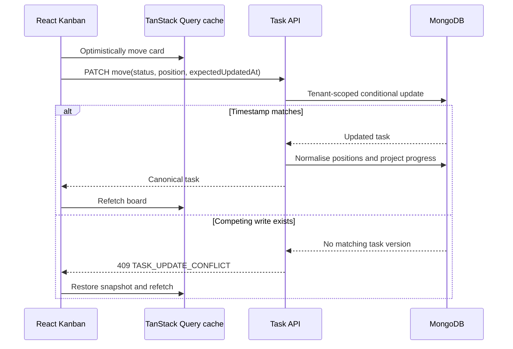
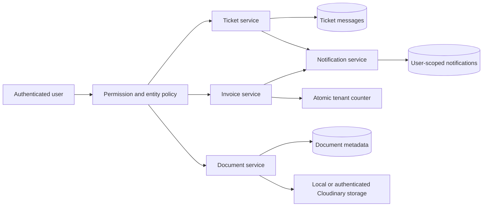
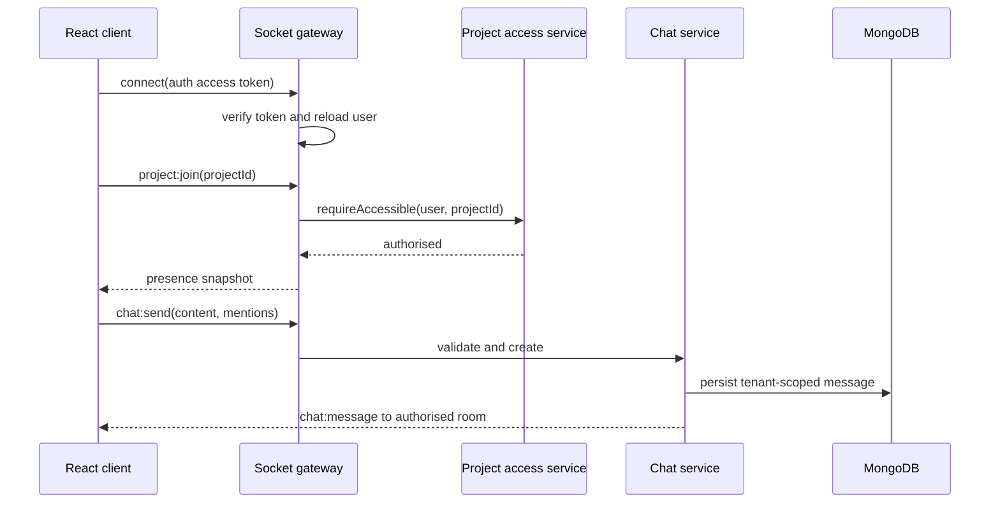

# NexOps AI Architecture

## Context

NexOps AI is a multi-tenant SaaS platform for agencies and IT service firms. It is implemented as a TypeScript monorepo with a React single-page application and an Express modular monolith. The modular monolith keeps deployment and local development straightforward while maintaining domain boundaries that can be extracted into services if scale warrants it.

## Runtime boundaries

### Web application

The web app uses feature-oriented modules. TanStack Query owns remote data and request lifecycle state. Zustand is limited to lightweight UI state such as theme, sidebar state, and ephemeral Kanban interactions. Forms use React Hook Form with Zod schemas shared with the API where appropriate.

### API application

Each backend domain follows the same dependency direction:

- Routes compose validation, authentication, tenant, and permission middleware.
- Controllers translate HTTP requests and responses without containing business rules.
- Services coordinate domain rules, transactions, notifications, audit entries, and provider calls.
- Repositories are the only normal path to Mongoose queries. Tenant-owned repositories require an organisation context at construction time.
- Models define indexes, invariants, serialization, and persistence types.

## Tenant isolation

All tenant-owned collections include `organisationId`. Authenticated requests derive the organisation from the verified identity; body and query parameters cannot override it. Tenant repositories merge `organisationId` into every filter and reject attempted organisation filters from callers. Entity-access policies add client and project membership constraints after the tenant boundary.

Defence in depth includes compound tenant indexes, model serialization rules, explicit projections, cross-tenant integration tests, and socket room names that include the verified organisation identifier.

## Authentication

Access tokens are short-lived JWTs sent as bearer tokens. Refresh tokens are opaque random secrets stored in signed, secure, HTTP-only cookies. Only a SHA-256 hash and rotation metadata are persisted. Each refresh atomically consumes the old token and creates a replacement; replay revokes the affected token family. The SPA keeps access tokens in memory and restores sessions through the refresh cookie instead of browser storage.

## Data and consistency decisions

- Money is stored in integer minor units and calculated with integer/decimal-safe helpers.
- Sequential invoice numbers use an organisation-scoped counter updated atomically.
- Unbounded messages, comments, ticket messages, task activity, and refresh tokens use separate collections rather than growing embedded arrays.
- Kanban ordering uses sortable positions plus a task version. Conflicting writes return a conflict response and trigger client reconciliation.
- Multi-document operations that require atomicity use MongoDB transactions in replica-set environments.

### Phase 4 delivery write path

Client, project, and task modules now implement the route-controller-service-repository boundary. Shared Zod contracts validate allow-listed fields, services enforce entity access and cross-organisation reference checks, and repositories add tenant filters to every normal query. The dashboard uses tenant-scoped aggregation pipelines and derives restricted project IDs before aggregating client, project-manager, or developer data.

### Phase 5 operational workflows

Tickets, invoices, documents, and notifications use the same mandatory tenant filter. Client identities receive an additional client-account constraint, while project documents also pass through the central project access policy. Ticket discussions are stored separately so threads can grow without inflating ticket records; internal notes are filtered at the repository boundary for client requests.

Invoice values remain integer minor units end-to-end. Fractional quantities use thousandths, and calculations use BigInt intermediates before range-checking the persisted number. The document storage interface exposes only `store`, `read`, and `delete`; web clients receive metadata and use an authorised API download rather than a provider or filesystem URL.

## Provider abstractions

AI, storage, email, and cache services expose provider-independent interfaces. Development defaults are a deterministic mock AI provider, local private file storage, disabled/log-only email, and optional no-op caching. Production adapters are selected only from validated server environment variables; provider secrets never enter the web bundle.

## Phase 6 real-time boundary

The HTTP application and Socket.IO gateway share identity, project access, chat, and publisher dependencies. Socket authentication verifies a short-lived access token and reloads the active user. Every connection joins only its organisation, user, and either staff or linked-client room. Project joins call the central project access service before adding a tenant-qualified room.

Presence is connection-counted so one user with multiple tabs appears once. Typing state is ephemeral. Chat sends are limited per socket, and acknowledgements use typed success/error envelopes. The publisher routes tasks to project rooms, tickets to staff plus the linked client room, and notifications to an individual user room. A single-instance in-memory adapter is currently used; a Redis adapter is required before horizontally scaling the API.

## Observability and failure handling

Every request receives or propagates an `x-request-id`. Pino emits structured, redacted logs. Errors are normalized to stable codes and response envelopes. Health endpoints distinguish liveness from readiness. The HTTP server, Socket.IO, MongoDB, and provider clients close gracefully on termination.
