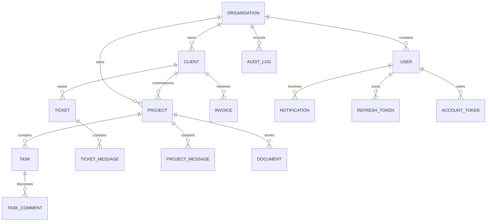

# Database Models

NexOps AI uses shared MongoDB collections. Every organisation-owned document has a required immutable `organisationId`, and operational indexes begin with that field. Organisation itself is the tenant root.

## Identity models

- `Organisation`: tenant root, slug, locale/currency defaults, and organisation settings.
- `User`: immutable organisation membership, optional client-account link, role, status, verification state, and password hash. Password hashes are excluded from normal queries and serialization.
- `Invitation`: hashed single-use invitation token, invited role, expiry, inviter, and lifecycle status.
- `RefreshToken`: one record per token rotation with a family identifier, hash, expiry, revocation, and limited request metadata. Tokens are separate from users to avoid unbounded arrays.
- `AccountToken`: hashed, single-use email-verification and password-reset tokens with TTL expiry.

## Delivery models

- `Client`: organisation-scoped company and contact data.
- `Project`: client relationship, manager and members, status, progress, dates, tags, budget in minor units, and bounded milestone data.
- `Task`: project work item with Kanban status, sortable position, optimistic versioning, assignees, time in minutes, labels, and bounded checklist items.
- `TaskComment`: separate chronological collection so task documents do not grow without bound.

Phase 4 repositories scope client, project, and task operations with the authenticated `organisationId`. Client users are further restricted by their `clientId`; project managers and developers by project manager/member fields; tasks inherit access from their parent project. Project keys are unique per organisation, and task board ordering uses the `{ organisationId, projectId, status, position }` index.

Task moves use `updatedAt` as a compare-and-set version before normalising integer positions in the target column. Project `progress` is recalculated after task creation, status changes, moves, and deletion from completed versus total task counts.

## Support, collaboration, and files

- `Ticket`: client/project support request, assignment, priority, workflow status, and SLA deadline.
- `TicketMessage`: separate discussion collection with an `internal` flag to keep staff notes hidden from clients.
- `ProjectMessage`: chronological project chat with mentions.
- `Document`: provider-neutral storage metadata and optional links to projects, clients, tasks, or tickets. Deleted files are soft-marked.

Phase 5 ticket reads combine the tenant key with a client-account constraint for client identities. Ticket messages remain independently pageable and repository queries exclude `internal: true` for clients. Document metadata never exposes the private provider locator; delete operations soft-mark metadata and remove the stored object.

Phase 6 project messages are written only after project access succeeds and are read through `{ organisationId, projectId, createdAt }` ordering. Sender profiles are loaded in one tenant-scoped query per history page, avoiding per-message lookups. Mentions are bounded, deduplicated, organisation-validated, and emitted as separate user notifications.

## Billing and operations

- `Invoice`: line items, dates, currency, status, and every total in integer minor units. Quantities use thousandths (`quantityMilli`) to avoid binary floating-point calculations.
- `InvoiceCounter`: one atomic sequence record per organisation for sequential invoice numbers.
- `Notification`: user-targeted in-app events with unread indexes.
- `AuditLog`: actor, action, entity, before/after values, safe metadata, IP address, and user agent. Services must redact credentials, tokens, and secrets before persistence.

Invoice numbers are allocated through an atomic organisation counter and formatted as `INV-YYYY-00001`. Intermediate line-item multiplication uses BigInt before range-checking values stored as safe integer minor units. Notifications are always queried with both `organisationId` and `userId`, including mark-read updates.

TTL indexes remove expired invitations, refresh tokens, and account tokens. TTL cleanup is asynchronous, so every consuming query also checks expiry explicitly.
