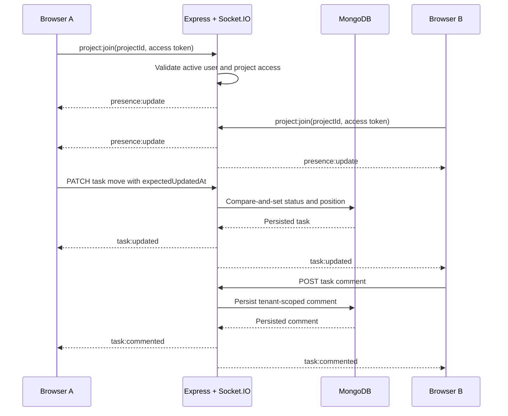

# Interview Assignment: Real-time Kanban Board Updates

This implementation completes the requested real-time Kanban simulation inside the production-oriented NexOps AI application.

## Requirement coverage

| Assignment requirement      | Implementation                                                                                                     |
| --------------------------- | ------------------------------------------------------------------------------------------------------------------ |
| Node.js and Express backend | Existing TypeScript Express API under `apps/api`.                                                                  |
| Socket.IO broadcasting      | Authenticated Socket.IO server shares the API HTTP server.                                                         |
| Specific project viewers    | Clients explicitly join a tenant-qualified project room after server-side project access validation.               |
| Task status changes         | Successful persisted task moves emit `task:updated`; remote clients reconcile affected columns without refreshing. |
| New comments                | REST creates tenant-scoped `TaskComment` records, then emits `task:commented` after persistence.                   |
| React live updates          | TanStack Query caches merge task and comment events in memory.                                                     |
| Presence                    | `presence:update` shows unique authenticated users viewing the project board and handles multiple tabs.            |
| Typing indicators           | `task:typing` broadcasts ephemeral per-task comment typing state to other board viewers.                           |
| MongoDB                     | Tasks and comments use tenant-scoped Mongoose models and indexes.                                                  |

## Architecture

## Run and demonstrate

1. Start Docker Desktop.
2. From the repository root, run `docker compose up --build`.
3. Open `http://localhost:5173` and register an organisation.
4. Create a client, project, and at least two tasks.
5. Open the same project Kanban URL in two authenticated browser windows.
6. Move a task in the first window; the second window changes immediately without refresh.
7. Select **Discuss** on the same task in both windows. Typing in one window displays a typing indicator in the other; posting displays the persisted comment in both.
8. The board header shows the number of authenticated viewers and reconnecting/live status.

## Security and reliability

- Socket connections require a valid short-lived access token and reload the active user.
- Project room joins rerun project and tenant access checks; guessed project IDs cannot subscribe.
- `organisationId`, author, and project identity are never accepted from comment request bodies.
- Task moves use `updatedAt` compare-and-set conflict detection, optimistic rollback, and canonical refetching after failure.
- Comment and task payloads use shared Zod/TypeScript contracts.
- Presence and typing are ephemeral; task comments and task moves persist in MongoDB.

## Verification

The focused test suite covers socket authentication, project-room denial, presence, task typing, task-update delivery, comment delivery, tenant-derived comment persistence, live-client reconciliation, comment deduplication, and the React discussion composer. Run all repository gates with `npm run validate`.
