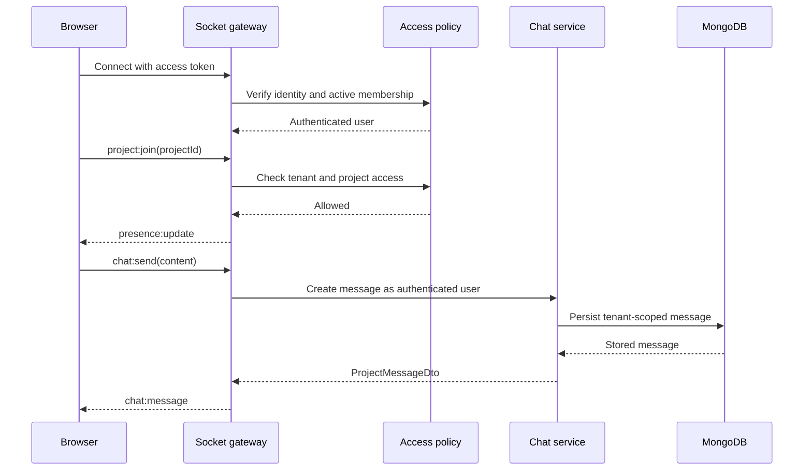

# Socket.IO Events

NexOps AI serves Socket.IO from the same HTTP server as the REST API. REST remains the source for initial and paginated state; Socket.IO delivers authenticated changes after a page has loaded.

## Connection and authentication

Connect to the API origin and pass the current short-lived access token in the Socket.IO authentication payload:

```ts
const socket = io(apiOrigin, {
  auth: { token: accessToken },
  transports: ['websocket'],
});
```

The server verifies the JWT and reloads the user before accepting the connection. Disabled users, expired tokens, and users whose organisation no longer matches the token are rejected with `connect_error`.

After authentication, the server automatically joins rooms scoped to the user's organisation, identity, and audience. Project rooms are never joined automatically; the client must request access with `project:join`, and the server re-runs project authorisation before joining.

## Client-to-server events

| Event           | Payload                             | Acknowledgement                | Purpose                                                          |
| --------------- | ----------------------------------- | ------------------------------ | ---------------------------------------------------------------- |
| `project:join`  | `{ projectId }`                     | `SocketAck`                    | Authorise and join a tenant-qualified project room.              |
| `project:leave` | `{ projectId }`                     | `SocketAck`                    | Leave a project room and update project presence.                |
| `typing:update` | `{ projectId, isTyping }`           | none                           | Broadcast an ephemeral project-chat typing state.                |
| `task:typing`   | `{ projectId, taskId, isTyping }`   | none                           | Broadcast task-comment typing to other authorised board viewers. |
| `chat:send`     | `{ projectId, content, mentions? }` | `SocketAck<ProjectMessageDto>` | Validate, persist, and publish a project message.                |

`chat:send` is rate-limited per socket and requires the socket to have joined the project first. Message content and identifiers are validated with shared Zod schemas. The authenticated user supplies the organisation and sender identity; neither value is accepted from the client.

Acknowledgements use this shape:

```ts
type SocketAck<T = undefined> =
  { success: true; data?: T } | { success: false; error: { code: string; message: string } };
```

## Server-to-client events

| Event              | Payload                                 | Audience                                           |
| ------------------ | --------------------------------------- | -------------------------------------------------- |
| `presence:update`  | `{ projectId, users }`                  | Authorised project room.                           |
| `typing:update`    | `{ projectId, user, isTyping }`         | Other users in the authorised project room.        |
| `task:typing`      | `{ projectId, taskId, user, isTyping }` | Other authorised board viewers.                    |
| `chat:message`     | `ProjectMessageDto`                     | Authorised project room.                           |
| `task:updated`     | `TaskDto`                               | Authorised project room.                           |
| `task:commented`   | `TaskCommentDto`                        | Authorised project room after persistence.         |
| `ticket:updated`   | `TicketDto`                             | Staff room plus the linked client's audience room. |
| `notification:new` | `NotificationDto`                       | The notification recipient's identity room.        |

Presence is tracked by user rather than raw socket so multiple browser tabs do not duplicate a person in the roster. It is intentionally ephemeral and resets when the API process restarts. The Kanban page rejoins its project room after reconnection and removes stale typing users when presence changes.

## Task discussion history

Task comments are paginated over REST and delivered live after creation:

```http
GET /api/v1/tasks/:taskId/comments?page=1&limit=50
POST /api/v1/tasks/:taskId/comments
Authorization: Bearer <access-token>
```

The POST body is `{ "content": "..." }`. The API derives the tenant, task, project, and author from authenticated state, persists the comment, then emits `task:commented` to the authorised project room.

## Message history

Historical messages are paginated over REST:

```http
GET /api/v1/projects/:projectId/messages?page=1&limit=50
Authorization: Bearer <access-token>
```

The endpoint applies the same project access policy as `project:join`. Sender profiles are loaded in one bulk query to avoid an N+1 query pattern.

## Communication flow



## Delivery guarantees and scaling

- Database persistence completes before `chat:message` or `task:commented` is emitted.
- REST refetching is the recovery path after disconnects; events are not an offline queue.
- The current development deployment uses Socket.IO's in-memory adapter and therefore targets one API instance.
- A Redis adapter should be configured before horizontally scaling the API so rooms and broadcasts span instances.
- Notification polling remains enabled as a fallback if a socket is temporarily unavailable.

## Security notes

- Room names include the organisation identifier to prevent cross-tenant collisions.
- Project membership is checked on the server; a client cannot subscribe by guessing an ID.
- Ticket events are split between internal staff and the linked client audience.
- Error acknowledgements contain stable codes and safe messages, never tokens or internal stack traces.
